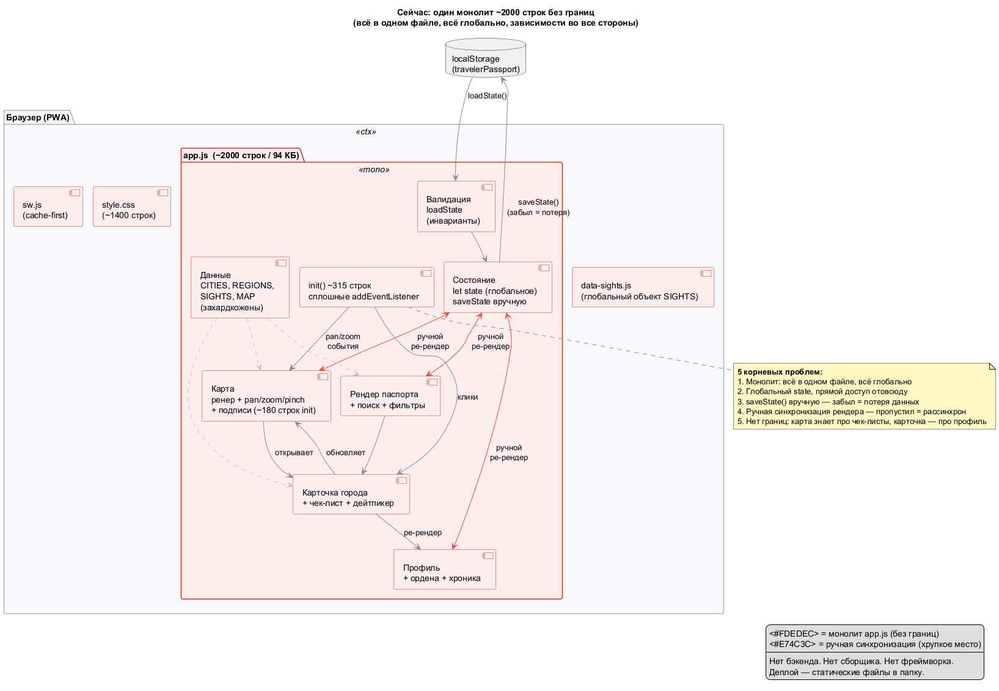
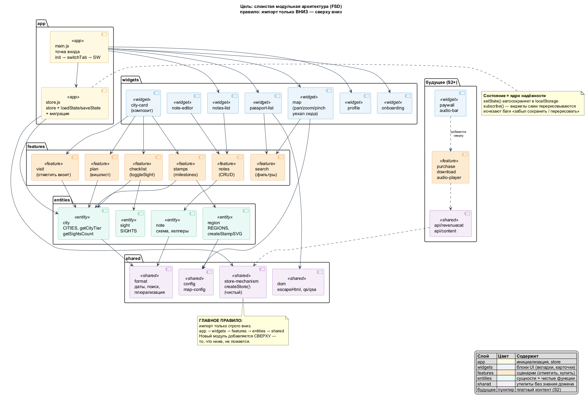
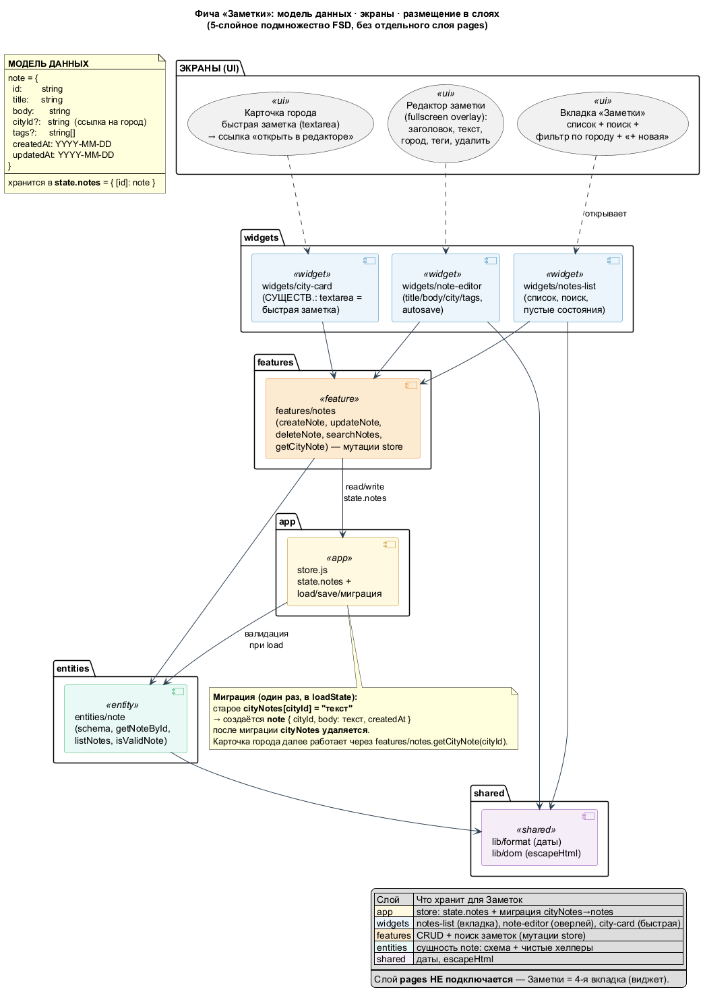
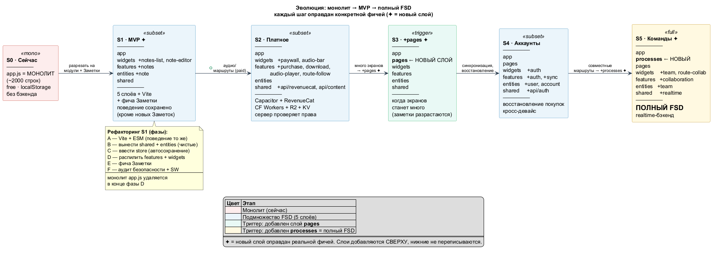

# Архитектура — «Паспорт путешественника по Беларуси»

> **Дата:** 2026-06-23 · **Статус:** draft
> Единый документ: продукт → видение → текущее состояние → этап S1 → дорожная карта.
> Схемы: `01-current-state`, `02-target`, `03-evolution`, `04-notes`.

---

## 1. Продукт

Мобильное приложение для путешественников по Беларуси. Пользователь «собирает»
паспорт: отмечает посещённые города, получает виртуальные штампы, повышает ранги
(Бронза → Серебро → Золото), изучает достопримечательности по чек-листам,
планирует поездки и ведёт заметки. Бесплатное ядро + разовая покупка контента
(аудиогиды, маршруты).

**Главная метрика:** возвращаемость — чтобы человек открывал приложение до, во
время и после каждой поездки.

| Параметр | Значение |
|---|---|
| Города | 57 в 7 регионах |
| Ранги | нет → Бронза → Серебро → Золото |
| Чек-листы | 15 топ-городов, 49 достопримечательностей |
| Форм-фактор | мобильное, портрет, 390–430dp |
| Офлайн | PWA + Service Worker (полная работа без сети) |

---

## 2. Карта фичей

> ✅ есть · 🚧 MVP (строим) · 💰 платно (S2) · 🔮 перспектива

| # | Фича | Статус |
|---|---|---|
| 1 | Паспорт и штампы (57 городов, коллекция по регионам) | ✅ |
| 2 | Ранги: Бронза → Серебро → Золото (чек-листы → рост ранга) | ✅ |
| 3 | Карта Беларуси (7 состояний маркеров, зум, подписи, фильтры) | ✅ |
| 4 | Планирование (вишлист «В планах», «Доисследовать», флажки) | ✅ |
| 5 | Профиль (ордена 🥇🥈🥉, прогресс по регионам, хроника) | ✅ |
| 6 | Офлайн-режим (PWA + Service Worker) | ✅ |
| 7 | **Заметки** (вкладка + редактор + быстрая заметка) | 🚧 |
| 8 | Аудиогиды (профессиональная озвучка по городу) | 💰 |
| 9 | Авторские маршруты (курируемые тематические) | 💰 |
| 10 | Глубокий контент (истории, скрытые жемчужины) | 💰 |
| 11 | Набор «Вся Беларусь» (пожизненный бандл) | 💰 |
| 12 | Аккаунты и синхронизация между устройствами | 🔮 |
| 13 | Восстановление покупок | 🔮 |
| 14 | Социальный шаринг, лидерборды, расширенные достижения | 🔮 |
| 15 | Совместное планирование (команды), общие маршруты | 🔮 |
| 16 | CMS для контента, AR-режим, расширение географии | 🔮 |

---

## 3. Текущее состояние (S0)

Чистый фронтенд-монолит: один `app.js` (~2000 строк) без бэкенда, без фреймворка,
без сборщика. Всё в одном файле, всё глобально.

**Пять корневых проблем:**
1. Монолит — всё в одном файле, всё глобально.
2. Глобальный `state`, прямой доступ отовсюду.
3. `saveState()` вручную — забыл = потеря данных.
4. Ручная синхронизация рендера — пропустил = рассинхрон.
5. Нет границ: карта знает про чек-листы, карточка — про профиль.

> ⚠ **Безопасность:** файл `conf` в корне содержит утёкший git-токен (уже в истории
> git — скомпрометирован). Удаление + ротация = **Phase 0**, до любой работы.

---

## 4. Целевая архитектура

**Три принципа:**

1. **Единая веб-кодовая база** → Capacitor собирает в нативные приложения (Android/iOS).
2. **Слои (Feature-Sliced Design).** Код по слоям, импорт — **только вниз**:
   `app → widgets → features → entities → shared`. MVP использует 5 слоёв; когда
   фичи требуют — сверху добавляются `pages` и `processes`. Нижние не переписываются.
3. **Тонкий бэкенд** (S2).** Cloudflare Workers + R2 (аудио) + KV (кэш). Без БД, пока
   нет аккаунтов. Сервер проверяет права (RevenueCat) перед выдачей аудио.

**Состояние = ядро надёжности:** `setState()` автосохраняет, `subscribe()` — виджеты
сами перерисовываются. Исчезают баги «забыл сохранить / перерисовать».

---

## 5. Этап S1 — фундамент (строим сейчас)

> **Принцип:** сначала фундамент, потом этажи. Рефакторим монолит до модульной
> структуры, которая открывает развитие **в любую сторону**, плюс первая фича — Заметки.

### 5.1 Что входит / не входит

| ВХОДИТ (S1) | НЕ входит |
|---|---|
| Рефакторинг `app.js` → 5-слойные модули (фазы A–F) | Платный контент, IAP (S2) |
| Фича «Заметки» (вкладка + редактор + быстрая) | Бэкенд (S2) |
| Миграция данных `cityNotes → notes` | Аккаунты (S4) |
| Vite (dev + бандл) | Команды (S5) |
| Автосохранение + авто-перерисовка (store) | Слои `pages`, `processes` |

### 5.2 Как S1 открывает любую сторону

| Будущее | Что добавляется | Что НЕ трогается |
|---|---|---|
| Заметки (S1) | `entities/note`, `features/notes`, `widgets/notes-*` | shared, app (только +notes) |
| Платное (S2) | `features/purchase+download+audio`, `widgets/paywall`, `shared/api/*` | entities, app/store |
| Аккаунты (S4) | `entities/user`, `features/auth+sync`, `shared/api/auth` | widgets (только +UI) |
| Команды (S5) | **новый слой `processes`** сверху | всё ниже — нетронуто |
| Новые экраны | **новый слой `pages`** сверху | всё ниже — нетронуто |

**Почему работает:** правило «импорт только вниз» — новый модуль или слой
добавляется сверху и физически не может сломать то, что ниже.

### 5.3 Фича «Заметки»

- **Модель:** `note { id, title, body, cityId?, tags?, createdAt, updatedAt }` в `state.notes`.
- **Экраны:** вкладка-список (поиск/фильтр/«+ новая»), редактор-оверлей (autosave),
  быстрая заметка в карточке города (textarea ↔ редактор синхронны).
- **Миграция:** `cityNotes[cityId]` → `note` с `cityId`, затем `cityNotes` удаляется.
- **Слои:** `pages` НЕ подключается — Заметки = 4-я вкладка (виджет).

---

## 6. Дорожная карта

| Этап | Триггер | Что меняется |
|---|---|---|
| **S0** Сейчас | — | Монолит |
| **S1** MVP | Заметки (#7) | 5 слоёв + Vite + store. app.js удалён. |
| **S2** Платное | Аудио/маршруты (#8–11) | Capacitor, RevenueCat, CF Workers/R2/KV |
| **S3** +pages | Много экранов | слой `pages` |
| **S4** Аккаунты | Синхро/соц (#12–14) | auth, БД |
| **S5** Команды | Совместное (#15) | +`processes` = полный FSD, realtime |
| **S6+** Платформа | CMS/AR (#16) | отдельные сервисы |

Каждый шаг приносит пользователю новую ценность, а коду — новый слой/сервис,
**только когда этого требует реальная фича**.

---

## 7. Ключевые решения

| Решение | Почему |
|---|---|
| Capacitor + нативные IAP | Повторное использование веб-базы; витрины сторов; конверсия |
| Разовые покупки, без подписок | Контент конечен; понятнее для пользователя |
| RevenueCat | Готовая валидация чеков; нет DIY-валидации |
| Анонимное устройство (MVP) | Нет стены регистрации; меньше фрикции |
| 5-слойное подмножество FSD | Дисциплина импортов; путь роста до полного FSD |
| Серверная проверка прав | Клиенту нельзя верить; подписанные ссылки на аудио |
| Статический JSON + аудио в R2 | Версионность контента; CMS-готовая структура |

---

## 8. Критерии приёмки S1

**Архитектура:**
- [ ] `app.js` удалён, код — в `src/` по слоям
- [ ] Импорты только вниз; store API вместо глобального state
- [ ] `setState` автосохраняет; `subscribe` перерисовывает
- [ ] Vite-сборка работает (dev + бандл)

**Поведение сохранено:**
- [ ] Онбординг, toggle визита, чек-листы (ранги), планирование, карта, профиль
- [ ] Перезагрузка — данные на месте; офлайн — работает

**Заметки:**
- [ ] Вкладка (список/поиск/«+ новая»), редактор (autosave/удалить)
- [ ] Быстрая заметка ↔ редактор синхронны; миграция `cityNotes → notes`

**Безопасность:**
- [ ] Нет утёкшего токена в репо; `conf` в `.gitignore`

---

## Приложение — детальные планы

| Файл | О чём |
|---|---|
| `.kilo/plans/refactor-and-notes.md` | Фазы A–F рефакторинга + спецификация Заметок + smoke-тесты |
| `.kilo/plans/monetization.md` | Модель монетизации: SKU, IAP, RevenueCat, бэкенд, фазы S2 |
| `.kilo/plans/MVP_v3/app-description_v3.md` | Детальный разбор текущей кодовой базы (v3) |
